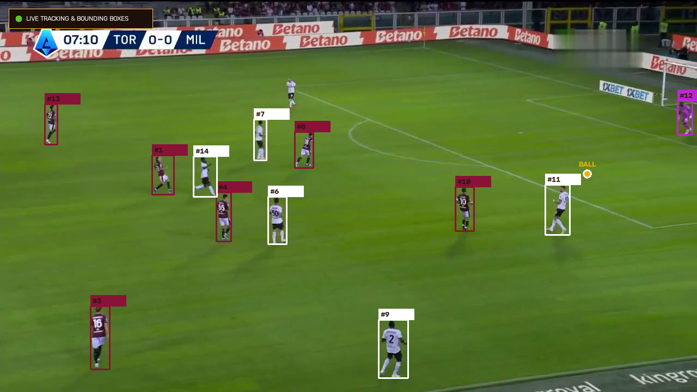
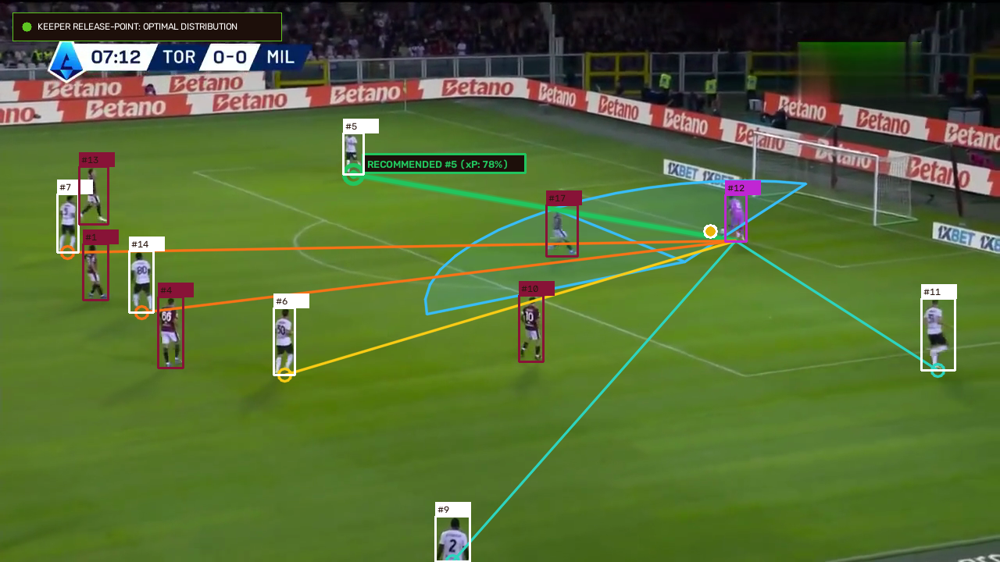

# GK Decision-Value Engine

Goalkeeper distribution valuation and decision-making engine conditioned on opponent press geometry and physics.

## Images





## Core Analytical Architecture

- **Video-based CV pipeline**: YOLO detection, multi-object tracking, pitch homography, and pose estimation.
- **Press geometry & kinematics**: Hungarian bipartite presser-to-outlet assignment and sprint burst acceleration vs decelerating Coulomb turf rolling friction ($\Delta t = t_{\text{press}} - t_{\text{receipt}}$).
- **Multi-objective decision frontier**: Pareto optimization balancing defensive safety cushion ($\Delta t$) against net expected threat progression ($\Delta\text{xG}$), enforcing saturation caps, baseline clearance floors, raycast occlusion, and touchline survival decay.
- **Continuous temporal passing windows**: 25 Hz sequence evaluation with differential separation kinematics ($\dot{d}_{\text{sep}}$), IFAB Law 11 kick-instant offside tracking, dynamic lateral interceptor detection, and decoupled physical moving-average smoothing.
- **Quantitative cockpit dashboard**: Interactive multi-episode HTML report integrating SVG Pareto frontiers, spatial physics radar/occlusion maps, and synchronized video playback.

## Quick Start

```bash
git clone https://github.com/Mohamed1756/open-gk.git
cd open-gk
python3.11 -m venv .venv
source .venv/bin/activate
pip install -r requirements.txt
python3 scripts/evaluate_distribution.py --episode all
open reports/goalkeeper_distribution_valuation.html
```

## Running Tests

```bash
pytest -x -q
ruff check src/ tests/
ruff format --check src/ tests/
```


